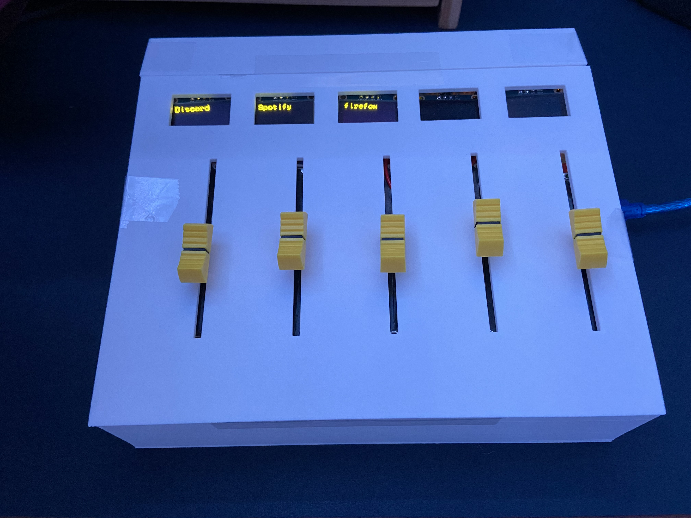

# Arduino Soundboard

A soundboard made for an Arduino Mega 2560 that connects to your PC to adjust the volume of applications.

## How to make

There are a few steps required... and some money.

### Ingredients

-   3D Printer (for case)
-   Arduino Mega 2560
-   Breadboard
-   \>20x M/F Jumper Wires
-   5x [10K Logarithmic Slide Potentiometer](https://www.amazon.com/dp/B01CZVZ16O)
-   5x [0.96 inch 128x64 OLED LCD I2C Screens](https://www.amazon.com/dp/B085WCRS7C)
-   Constant USB connection to computer

### Steps

1. Clone this repo
2. Arduino Setup
    1. Install [Arduino IDE](https://www.arduino.cc/en/software)
    2. Open `arduino/arduino.ino` in the IDE
    3. Install all libraries from `arduino/libraries/`
        - To do this, use the IDE and navigate to `Sketch > Include Libraries > Add .ZIP Library...` and select the `.zip` files in the `libraries` folder.
    4. Connect the Arduino to your computer via USB
    5. Select the Arduino Mega 2560 and port in the IDE
    6. Upload the code to the Arduino
3. 3D Printing
    1. Download the STL file from [here](Case.md)
    2. Print it (any color, any filament, it doesn't matter)
4. Assembly (this requires _some_ knowledge of electronics)
    1. Put the Arduino in the case, so the hole lines up with the port
    2. Adhere the back of your breadboard to the back inside part of the case
    3. Put all of the potentiometers (take off the caps) on the pedestals and adhere them to said pedsatals (I used tape)
    4. Wire all of the potentiometers to the arduino, where the first one is connected to A10, then second to A11, etc.
    5. Wire all of the potentiometers to power (5V) and ground on the breadboard.
    6. Adhere the screens to the holes (more tape)
    7. Wire all the screens so that the first one's SCL is connected to A0, SDA to A1, second one's SCL to A2, SDA to A3, etc.
    8. Connect the screens to power (5V) and ground on the breadboard.
    9. Adhere the screens to the lid (more tape)
    10. Put the lid on the case (this may require some force), make sure the potentiometers are in the holes
    11. Adhere the lid to the case (more tape)
    12. Almost there, put the caps on the potentiometers and put the small lid on the case
    13. Connect Arduino to computer via USB
5. PC Setup
    1. Install [Node.js](https://nodejs.org/en/) and make sure it came with `npm`
    2. Run `npm i` to install all required packages
    3. Copy `node_modules/@serialport/bindings-cpp/prebuilds` into `out` (make the out folder if it doesn't exist)
    4. Make sure your Arduino is connected to your computer via USB and running with the Arduino program
    5. Run `npm start` to start the program
    6. Make sure the program is working properly by moving the sliders and hearing the volume of the application change
6. Adding to start
    1. After running the commands from before and making sure it is working, run `npm run package` in your terminal.
    2. Change the path on the 3rd line of `soundboard_nogui.vbs` to the path of `out`.
    3. Put `soundboard_nogui.vbs` to your startup folder (Windows: `C:\Users\<user>\AppData\Roaming\Microsoft\Windows\Start Menu\Programs\Startup`)

### Additional Notes

-   You can change all of the values from `config.json`, you must restart after changing any heartbeat related values.
    -   `blacklistProcesses`: A list of processes to ignore, to add one, just add the exact name of the process from the soundboard to the array.
    -   `priorityProcesses`: A list of processes to give priority to, to add one, just add the exact name of the process from the soundboard to the array. This will move that process to the front.
    -   `heartbeatInterval`: The interval in milliseconds to send a heartbeat to the Arduino. This is used to make sure the Arduino is still connected.
    -   `heartbeatTimeout`: The timeout in milliseconds to wait for a heartbeat from the Arduino. If the Arduino does not send a heartbeat in this time, the program will re-open a connection to the Arduino.
-   To shut down the program, open task manager and find `Node.js JavaScript Runtime` (you may have to scroll a while), and end the task.
-   If the PC disconnects from the Arduino (the program stops), the soundboard will tell you.
-   If the PC is disconnected forcefully (unplugged), you will notice the soundboard will not tell you, but the program will stop working.
-   There is a `logs.txt` file where the executable is, it may get big if you leave it running for a while.
-   If a heartbeat fails (the Arduino is not responding), the program will try to reconnect to the Arduino. This takes a few seconds, so you may notice a delay in the volume changing.
-   This project is by no means perfect, this is just something fun I made in my free time. If you have any suggestions, feel free to open an issue or pull request.
